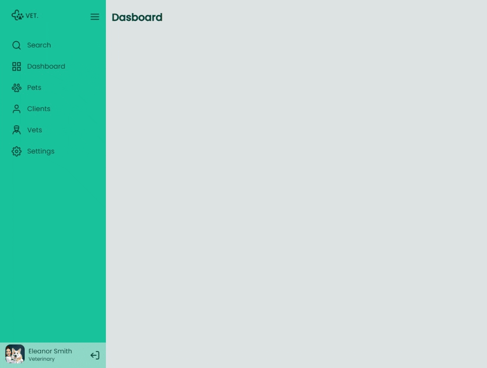

# frontend-sidebar
<h2>Challenge frontend Sidebar</h2>

<h2>Responsive Page</h2>

<strong>:hammer_and_wrench: Project:</strong> Convert figma Layout to Frontend code. Using:

<ul>
  <li> HTML</li>
  <li> CSS</li>
  <li> Sass SCSS</li>
  <li> Media Queries</li>
  <li> Flexbox</li>
  <li> Grid</li>
  <li> Javascript</li>
</ul>

I wrote from scratch all code without any video reference.

In CSS, along with Sass, I'm using colors variables, viewport breakpoints, REM sizes, CSS reset, media queries, flexbox and grid.

<h3>Plus:</h3>

I added Sass to the project to help me on some CSS settings.

The layout in Figma required to make a collapsible Sidebar with a dashboard menu. Clicking on the upper menu icon should change the sidebar state from opened to closed, showing icons only. This transition should have an smooth animation.

Additionally, I added hover effects for the menu, logo, logout and menu items. Also, I made a sticky visual color for the current menu and changed the content on the right side according to the current menu selected.

I made just the desktop version to keep it simple.

<h2>Example Images</h2>

Desktop 

